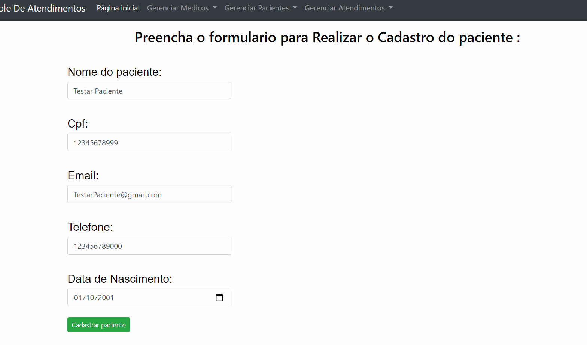
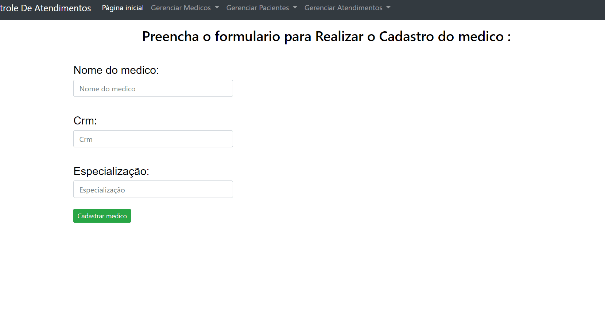
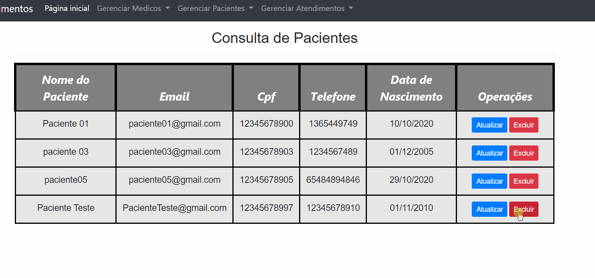

# Menu De Atendimentos.

### Sistema de Cadastro :

  

### Validações :

  

### Regras de Negocio :

  

## Objetivo :
- Projeto utilizando uma Api para desenvolver um sistema de Cadastro e Consulta de Atendimentos. 

## Tecnologias Utilizadas:
- C#.
- Entity Framework.
- Angular.
- BootsTrap.
- JavaScript.

## Como Executar :
- Inicie o FrontEnd e execute no terminal **"npm install"** para baixar o node_modules.

- Abra no **http://localhost:4200**.

- Para ter Acesso a um sistema de Cadastro Funcional será necessario Executar o BackEnd.
